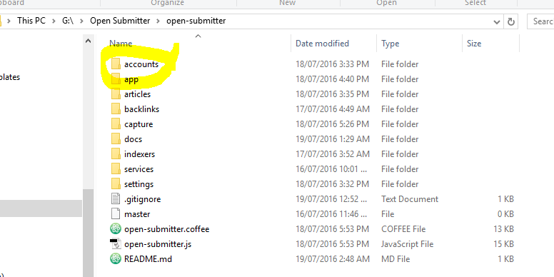
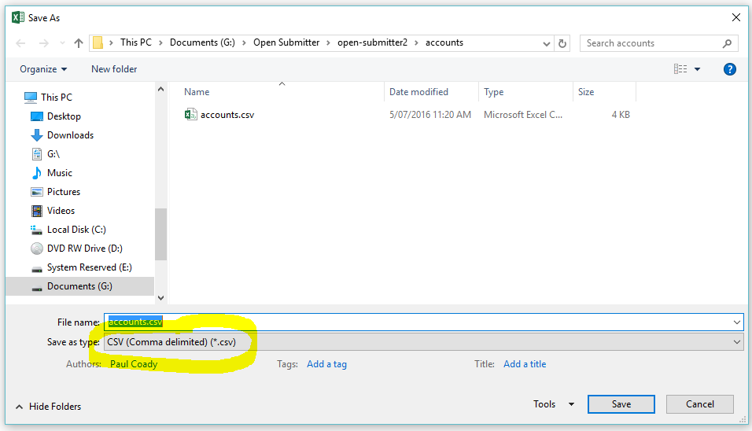

# Open Submitter Accounts

Accounts are required for Open Submitter to login and submit your articles.

## Creating Accounts

Each service (e.g. Wordpress) will have its own process for creating accounts. Normally only one account per email address can be created. Free emails can be created at mail.ru (use Google Chrome Translate to view in English). After your accounts are created you will need the login names (or email addresses if applicable), passwords and site names (if applicable). Try to create many accounts for each service.

## Creating Accounts List file

Open Submitter will look for your acounts file in the accounts directory of the Open Subnmitter root directory. This does not exist so you need to create it first. Make sure the folder name is in lowercase.

Account lists need to be created in csv format. Open a spreadsheet application and create a new spreadsheet with the account details on each row in the following order:
- service id (see [current available services][3f03f862])
- username
- password
- site name (if applicable)

  [3f03f862]: current-services.md "Open Submitter Current Available Services"

Now save your file as csv type in the accounts folder.

[Documentation Home][03b4df1a]

  [03b4df1a]: readme.md "Open Submitter Documentation"
