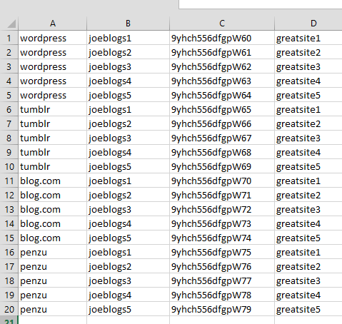

# Open Submitter Accounts

Accounts are required for Open Submitter to login and submit your articles.

## Creating Accounts

Each service (e.g. Wordpress) will have its own process for creating accounts. Normally only one account per email address can be created. Free emails can be created at mail.ru (use Google Chrome Translate to view in English). After your account is created you will need the login name (or email address if applicable), password and site name (if applicable).

## Creating Accounts List file

Account lists need to be created in csv format. Open a spreadsheet application and create a new spreadsheet with the account details on each row in the following order:
- service id (see current available services)
- username
- password
- site name (if applicable)

