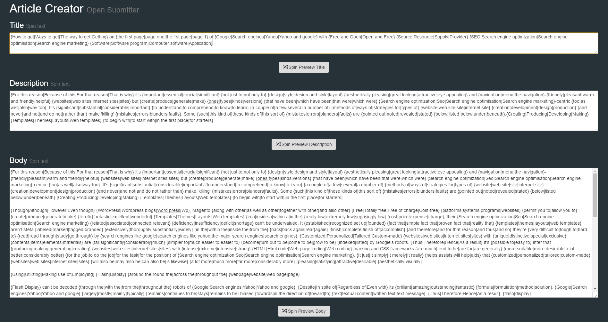
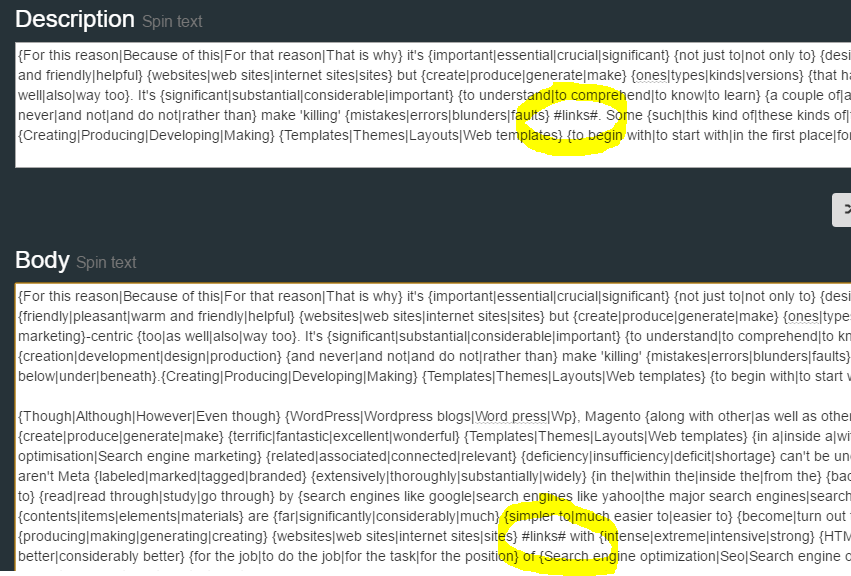
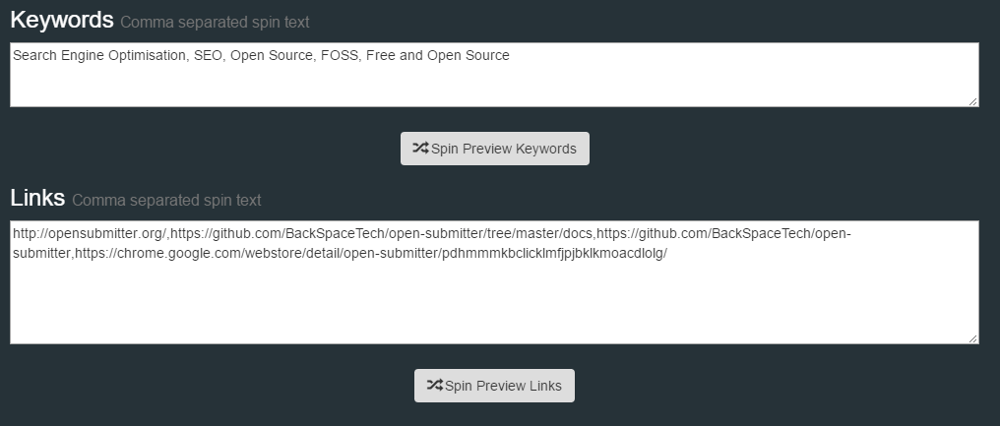
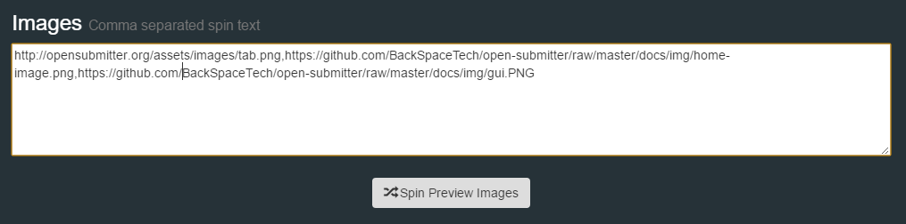
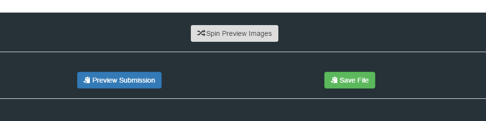
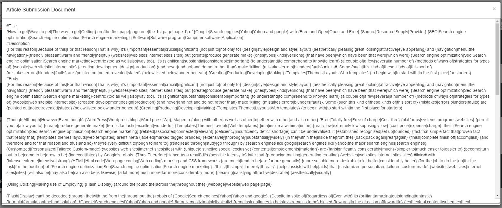
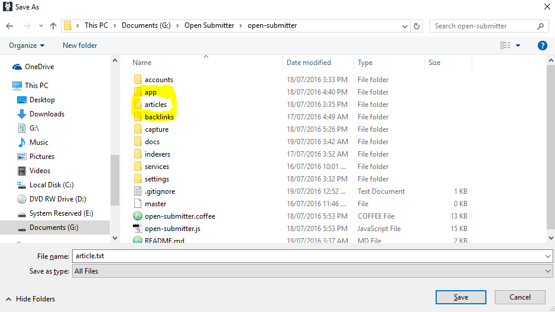

# Open Submitter Article Submissions

Open Submitter article submission files contain the following information:
- Title of article to be submitted in spin text.
- Description of article in spin text.
- Body of article in spin text.
- Keywords in spin text and comma separated.
- Link URLs in spin text and comma separated.
- Image URLs in spin text and comma separated.

## Using Spin Syntax

Spin syntax is used to allow Open Submitter to create unlimited unique articles to be submitted to services. Spin is surrounded by curly brackets {} and synonyms are separated by pipe symbols | e.g.

**Phrase:**

My great blog post.

**Spin Syntax:**

{My|A|This is a|A really} {great|awesome|cool} {blog post|article|review|commentary}

**Example results after spinning**

A cool commentary

A really awesome commentary

A great review

This is a cool blog post

My great commentary

**Important Note**

Do not nest spin as it will give unpredictable results with Open Submitter. e.g.

Don't use this:

{{this|this2}|this3}

Only use this:

{this|this2|this3}

## Spinning Tools

Creating articles of any size in spin syntax manually is very slow process. The most popular tool used by professional SEO consultants to speed up this process is [The Best Spinner][3a94b86c].

## Create an Article

Open the GUI and click "Create Article"

Enter the title, description and body of your article. Click Spin Preview to see the results after spinning.

## Add Link Tags to Article

To create backlinks in your article body and description where you want insert link tags (#links#). Open Submitter will insert a random keyword with a random link from the article keyword and link list. If no link tags are put in, Open Submitter will place one at the end. Do not insert too many link tags as search engines may reject the article as spam. Don't exceed one link per two paragraphs. The best results will come from having only one link only in the article body and description. Do not put links in title as these will not be recognised by Open Submitter.

## Add keywords, links.

Keywords and links need to be supplied for Open Submitter to use. These are comma separated. Open Submitter will select randomly. Spin syntax can be used to group together long tail keywords and less important links. This way you can influence the ratio of selection of links and keywords.

## Add Images

Images make articles look more interesting and less spammy. Open Submitter selects images at random from the images list supplied. These are comma separated URLs. The imgaes are randomly located vertically and randomly floating left or right. Please note not all services accept images.

## Create and Save Submission File

Click on "Preview Submission" to see your final submission.

Now Save the article submission file to the articles folder (you will need to create this folder). Please note it must be saved in the article folder only for open submitter to find it. Make sure the folder name is lowercase. If you have multiple submission files you can use multiple submission file names. All file names must have the .txt file extension. If you want multiple submissions in a single file simply use an editor such as Notepad++ and add them one after the other. Open Submitter will randomly select articles if multiple are available.

[Documentation Home][91a747ec]

  [91a747ec]: readme.md "Open Submitter Documentation"

  [3a94b86c]: http://paydotcom.net/r/95330/pcoady/27453918/ "The Best Spinner"
