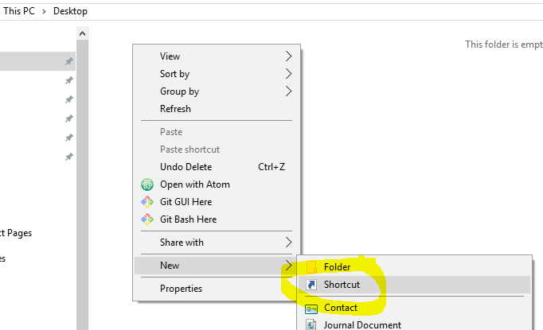
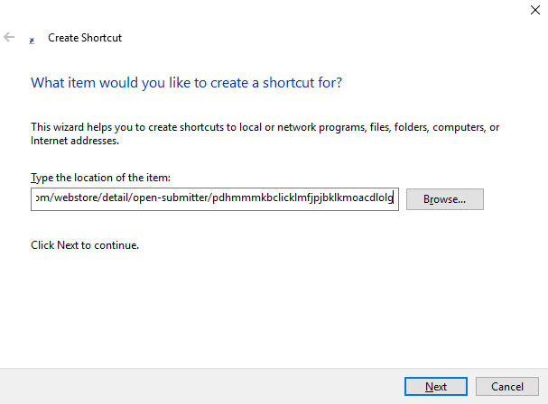
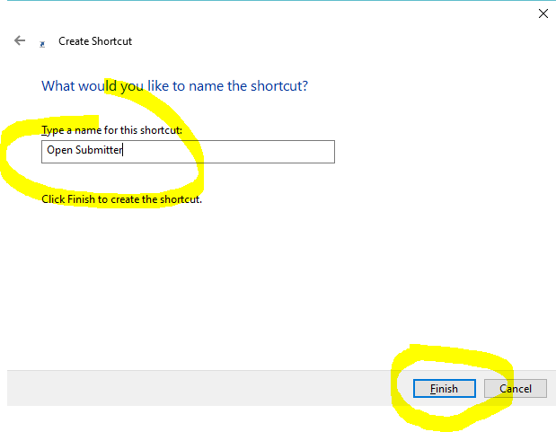

# Open Submitter Graphical User Interface (GUI)

The Graphical User Interface (GUI) simplifies the creation of article submission files and indexer setup files.

It can be download and installed from the [Chrome app store][db40ed37].

## Create shortcut for app

Navigate to your desktop in file explorer. Right click and select create shortcut.

Paste the URL for the app:
https://chrome.google.com/webstore/detail/open-submitter/pdhmmmkbclicklmfjpjbklkmoacdlolg

Click Next

Give the link the name Open Submitter

Click Finish

Check your desktop to find the link to the app.

[Documentation Home][47774e43]

  [db40ed37]: https://chrome.google.com/webstore/detail/open-submitter/pdhmmmkbclicklmfjpjbklkmoacdlolg "Open Submitter App"
  [47774e43]: readme.md "Open Submitter Documentation"
