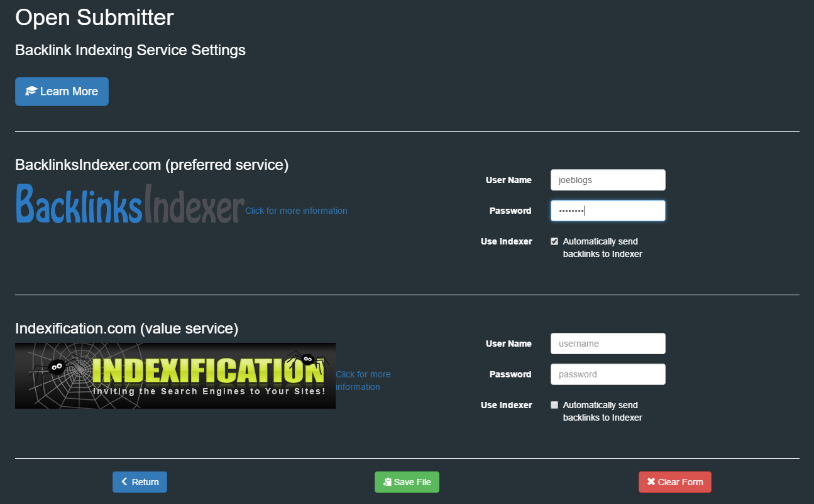
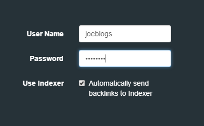
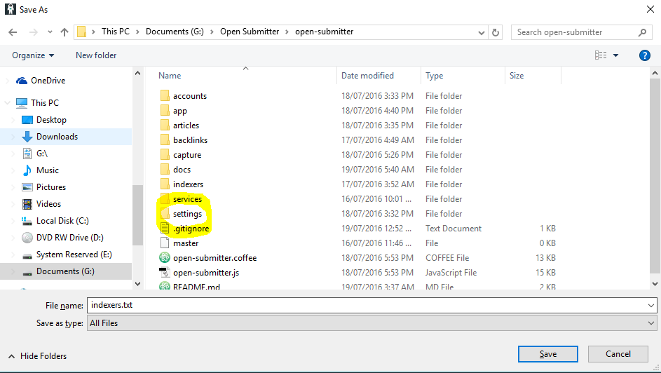

# Set Up Indexing Services

An indexing service is required to drive search engines to your submitted articles. The techniques used vary but are generally pinging based (poor quality) or backlink based. Depending on the technique used by the service, results can vary. Some services can get links on to search engines only to have then drop off later. The ratio of new to lost links is a significant factor in search engine ranking. This may not be an issue if you are just getting paid to create new backlinks.

[BacklinksIndexer.com][ace3719b] is recommended if your require high ranking on search engines. This service will provide high quality tier 1, 2 and 3 backlinks to your articles. This can be used to not only index your article backlinks, but you can also submit your main site URLs regularly to create further backlinks from various domains. This makes your SEO campaign look more natural to search engines.

[Indexification.com][44bd53cf] is a low cost indexing service with good indexing rates at very low cost. This is a good service for SEO contractors that are getting paid to create links on a regular basis for clients. It is also a good option to use as a backup to a premium service when you run out of monthly credits.

## Create Indexers Configuration File

When you have created your accounts with an indexing provider you can set up Open Submitter to automatically submit URLs to them. Open the GUI app and select "Set Up Indexers".

Enter your username and account for the service. Make sure you check "Automatically send backlinks to indexer".

Now save the file as indexers.txt to the settings folder.

[Documentation Home][3acc32de]

  [3acc32de]: readme.md "Open Submitter Documentation"

  [44bd53cf]: http://aff.innocoders.com/idevaffiliate.php?id=1640_2_3_1 "Indexification.com"

  [ace3719b]: http://jvz1.com/c/540185/31395 "BacklinksIndexer.com"
