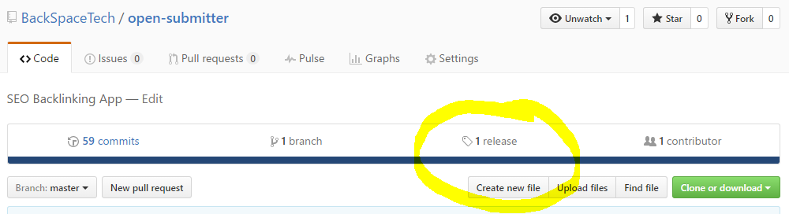
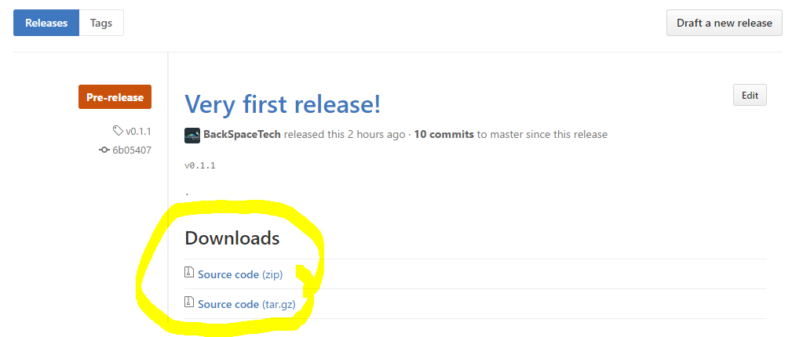
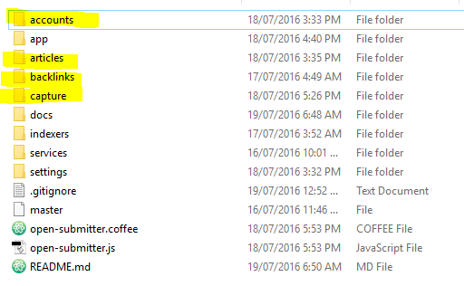
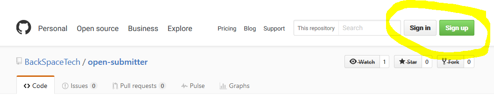
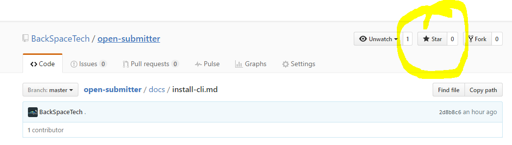
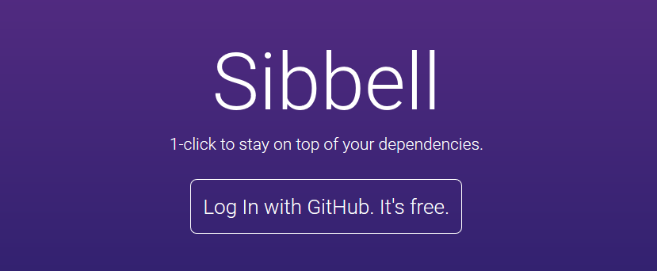

# Set Up Open Submitter

How to set up the Open Submitter Command Line Interface (CLI). The CLI is required to submit articles to services.

## Prerequisites
Please ensure the following prerequisite frameworks and applications are installed.

NPM modules need to be installed globally (npm install -g):
- [NodeJS][ca1dffb7] v4.4.7 or greater
- [PhantomJS][6997c770] v2.1 or greater
- [CasperJS][476ee510] v1.1.1 or greater
- [Cmder][9924c39d] (optional)
- [The Best Spinner][a6914f8e] (optional)

  [ca1dffb7]: http://nodejs.org/ "NodeJS"
  [6997c770]: http://phantomjs.org/ "PhantomJS"
  [476ee510]: http://casperjs.org/ "CasperJS"
  [9924c39d]: http://cmder.net/ "Cmder"
  [a6914f8e]: http://paydotcom.net/r/95330/pcoady/27453918/ "The Best Spinner"

## Update Environment Variables
Make sure your path environment variables are updated for NodeJS, PhantomJS, CasperJS and Cmder with the executable path.
Depending on where you installed the software the paths will be similar to:
- C:\Program Files\nodejs\
- C:\phantomjs
- C:\casperjs\batchbin

## Check Prerequisities
After the executables paths have been added to your environment variables you can check they are installed correctly using the following commands from the command line:
- node --version
- phantomjs --version
- casperjs --version

If everything is installed correctly each command will return the curent version details.

If you have any problems installing the prerequisite frameworks please post a question on [Stack Overflow][0f0072cf].

  [0f0072cf]: stackoverflow.com "Open Submitter Stack Overflow"

## Download latest release of Open Submitter

Go to the main [repository page](https://github.com/BackSpaceTech/open-submitter).

Click the releases.

Download archive file (zip or tar)

Extract archive to the location you want Open Submitter.

## Create additional required folders

The following additional folders need to be created after the archive is extracted. Make sure all folder names are lowercase:
- accounts
- articles
- backlinks
- capture

## Set up Sibbel

Sibble will notify you by email of any repository changes to repositories you have starred. Always update immediately with new releases which can include bug fixes and new features and services. Sibbel does not spam you.

First open a free GitHub account:

Then star the Open Submitter repository:

Then go to to Sibbel.com and set up Sibble.

You will now be notified by email of any new releases to Open Submitter.
### When copying a new release over an old, make sure you save your accounts, backlinks and settings/indexers.txt files before copying the new files.

[Documentation Home][bdc43f25]

  [bdc43f25]: readme.md "Open Submitter Documentation"
