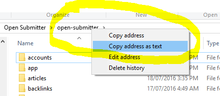
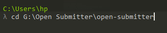
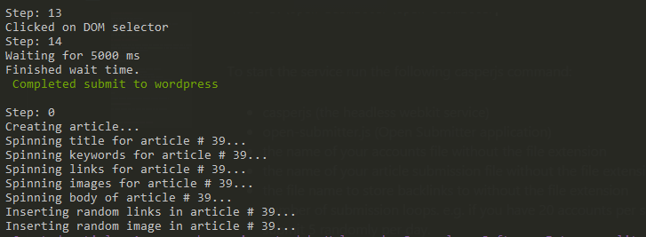
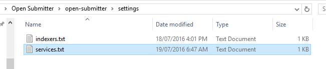
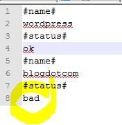

# Submitting to Services

Once you have set up Open Submitter:
- prequesite frameworks installed and tested
- article submission file has been created and saved to the articles folder
- accounts csv file created and saved to accounts folder
- indexing service file created and saved to settings folder

You can now start the submit service.

## Starting the Submit Service

The submit service must be started through the Command Line Interface (CLI). Open a command console (we recommend using the free app [Cmder][35fd80d0] if you are using Windows) and navigate to the Open Submitter directory.

To start the service run the following casperjs command:
- casperjs (the headless webkit service)
- open-submitter.js (Open Submitter application)
- the name of your accounts file without the file extension
- the name of your article submission file without the file extension
- the file name to store backlinks to without the file extension
- number of submission loops. e.g. if you have 20 accounts per service you may want to submit 5 randomly per day.

e.g.

casperjs casperjs open-submitter.js accounts articles backlinks 5

The submit service will now start submitting the article to the services.

After each article is submitted it is added to the backlinks file. When all the submissions have been completed Open Submitter will submit the URLs to the indexing service.

If any services are not working they can be disabled (ses below).

## Enabling and Disabling Unreliable Services

Not all services are reliable and many seem to be down more than they are up. Unreliable services can be disabled and enabled back again when reliable. To disable a service open the services.txt file in the setting folder. We recommend using the free app [Notepad++][a35f49bf] as the formatting is not changed when editing:

Now change the status of the service from ok to bad.

**Note:** Make sure you do not change the file name, otherwise Open Submitter won't find it again.

  [a35f49bf]: https://notepad-plus-plus.org/ "Notepad++"

  [35fd80d0]: http://cmder.net/ "Cmder Console"
